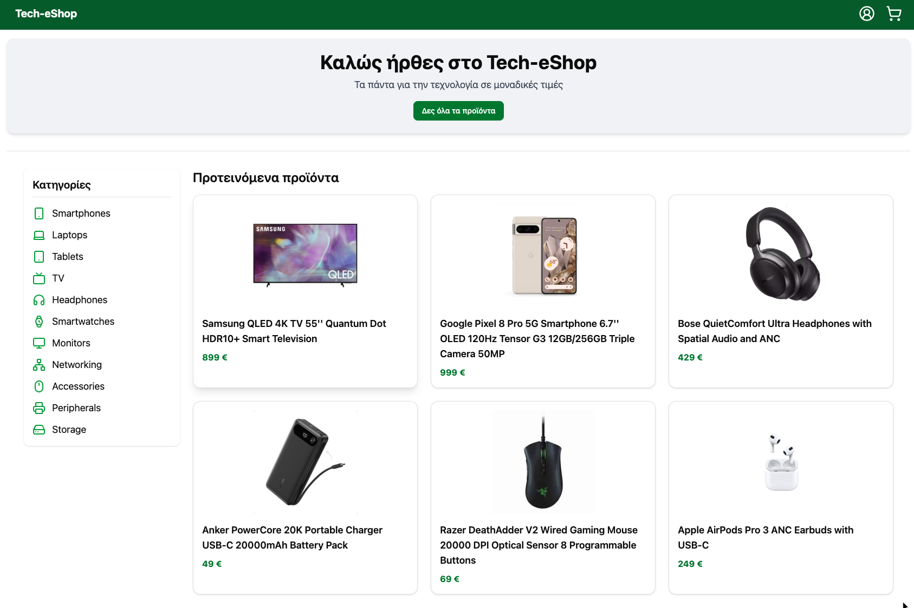
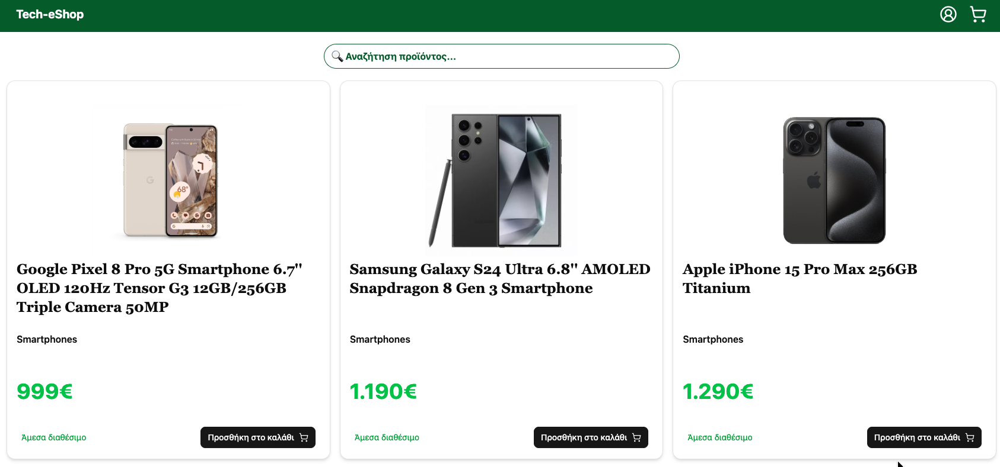
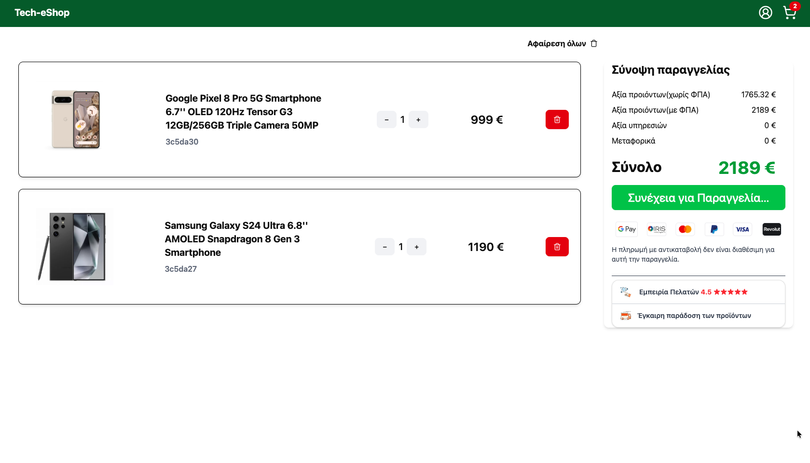
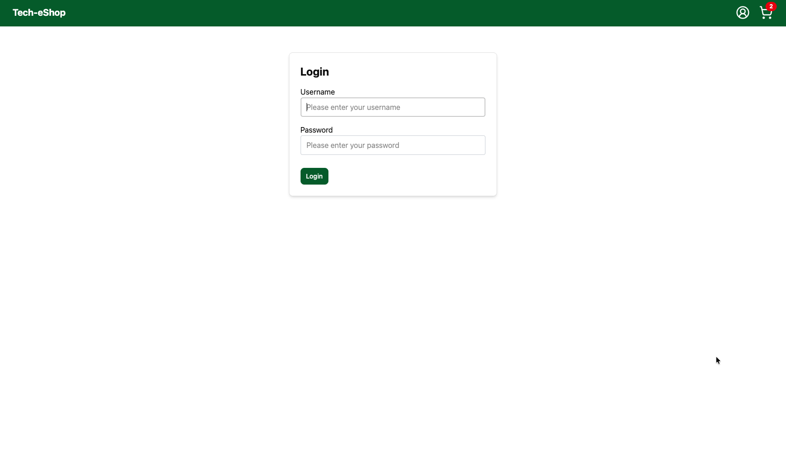
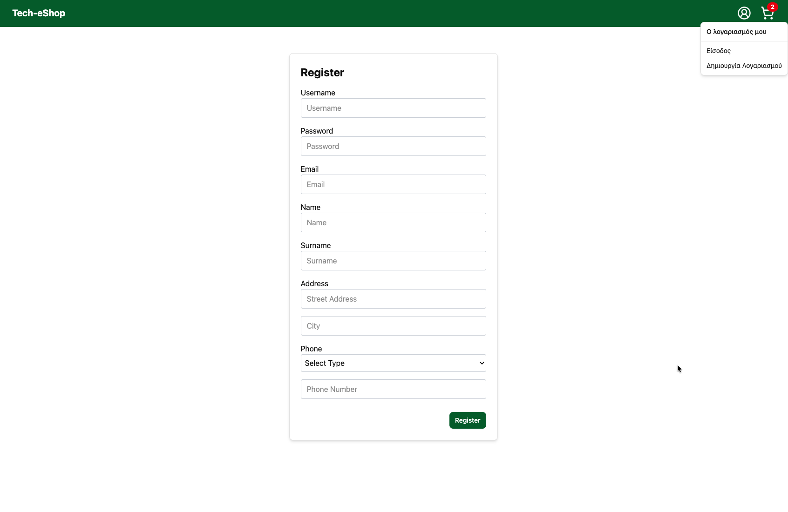
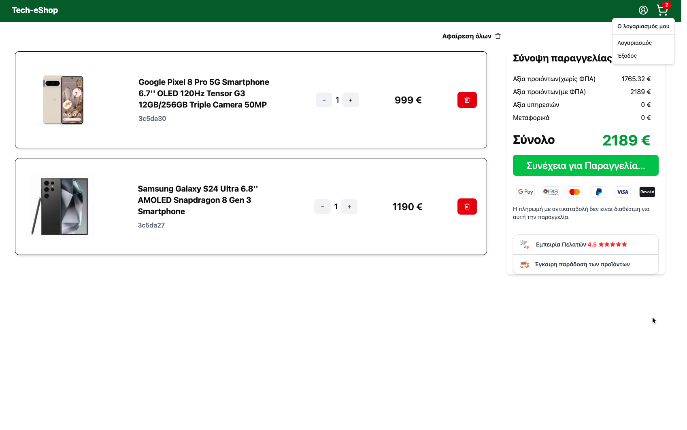
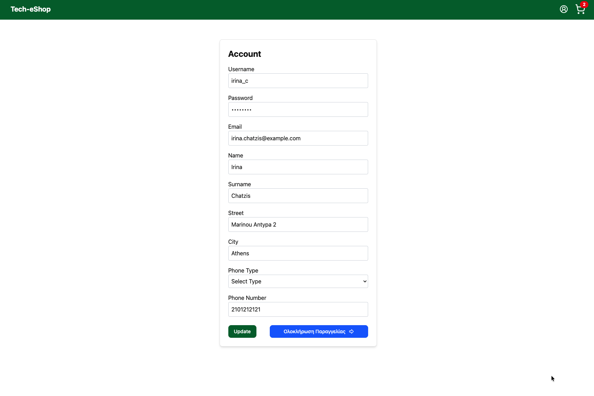
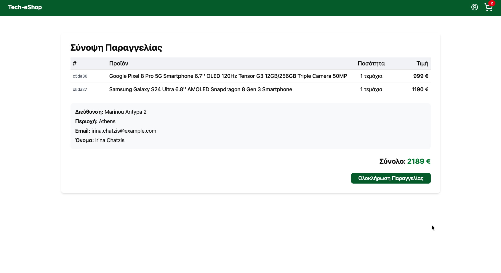
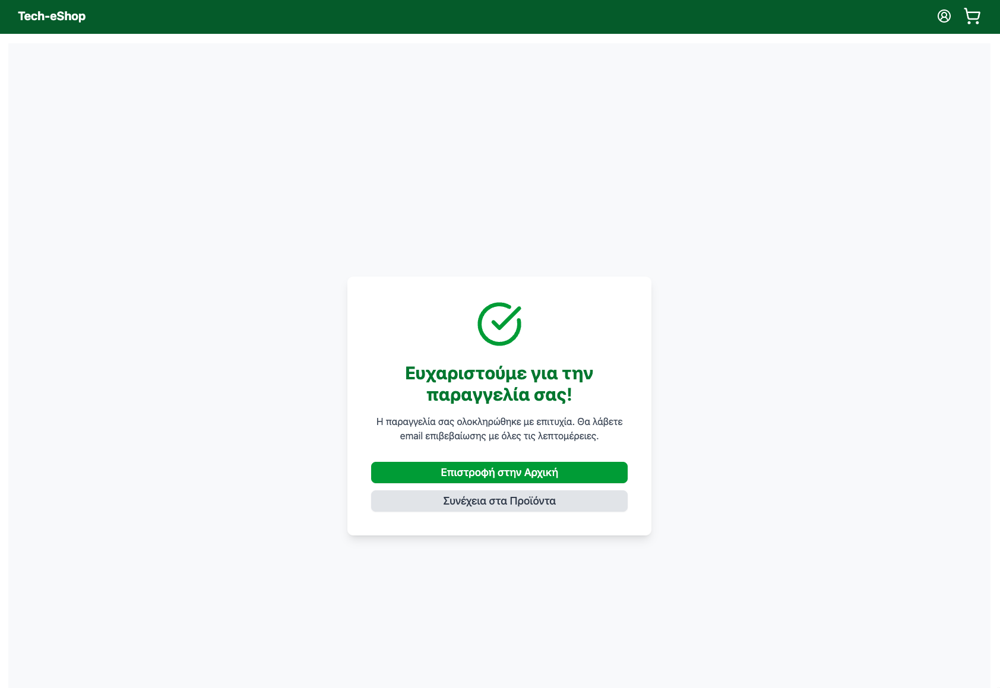

# CODING-FACTORY-FE-TECH-ESHOP

Author: Γιώργος Τζεμπελίκος

Project για το Coding Factory – Athens University of Economics & Business


# Tech-eShop

Full-stack e-commerce application developed for Coding Factory. A complete online shopping platform with user authentication, product management, and order processing.

## 📋 Project Overview

Tech-eShop is a modern e-commerce solution that allows users to register, browse products, manage shopping carts, and complete orders. The application features role-based access control and a comprehensive admin panel.

## Live Demo: ⚙️ [FE-TECH-ESHOP](https://coding-factory-fe-tech-eshop-cuhzxmx91-tzempes-projects.vercel.app/) 
## Live Api-docs: [API-DOCS](https://coding-factory-fe-tech-eshop.onrender.com/api-docs/)

## Quick Start

### Prerequisites
- Node.js
- MongoDB connection


### Installation & Running

1. **Clone the repository**
```bash
git clone https://github.com/gtzempe/CODING-FACTORY-FE-TECH-ESHOP.git
cd CODING-FACTORY-FE-TECH-ESHOP
```
2. Setup Backend
```bash
cd backend
npm install
npm run dev
```

3. Setup Frontend (in a new terminal)
```bash
cd frontend
npm install
npm run dev
```

## Environment Setup

Backend:

Create backend/.env file:
```env
MONGODB_URI=your_mongodb_connection_string_here
JWT_SECRET=your_jwt_secret_key_here
```
Frontend:

Create frontend/.env file:
```env
VITE_API_URL=http://localhost:3000/api
```

## Access Points:

Frontend Application: http://localhost:5173

Backend API: http://localhost:3000

API Documentation: http://localhost:3000/api-docs


## Demo Accounts
```
	Role	Username	Password	Access
	
1.	Admin:	admin	    123!@#	    Full system access
2.	User:	irina_c	    123!@#	    Customer features
3.	User:	zach_dev	123!@#	    Customer features
```


## What to Test


### As Customer 

* User login & authentication

* Browse products & search

* Add/remove items from cart

* Complete checkout process

* View order history

### As Admin 

- Admin dashboard access

+ User management

+ Product CRUD operations

+ Order management system

+ Inventory control


## Technology Stack

### Frontend:

* React 18 with TypeScript

* Vite - Build tool

* TailwindCSS - Styling

* ShadCN/UI - Components

* Context API - State management

* React Router - Navigation

### Backend:

* Node.js with Express & TypeScript

* MongoDB with Mongoose

* JWT Authentication

* Swagger - API documentation

* Jest - Testing framework


## Project Structure

```
CF7 FINAL EXAM ESHOP/
backend/
├── controllers/       # Business logic handlers
├── dao/              # Data Access Objects
├── dto/              # Data Transfer Objects
├── files/            # Postman collection & seed data
├── middlewares/      # Authentication & validation
├── models/           # MongoDB schemas
├── routes/           # API endpoints
├── services/         # Business logic services
├── tests/            # Jest test suites
├── utils/            # Utilities & configurations
├── app.js            # Express app setup
└── server.js         # Application entry point
│
frontend/
├── src/
│   ├── api/           # API service functions
│   ├── components/    # Reusable UI components
│   ├── context/       # AuthContext & CartContext
│   ├── hooks/         # Custom React hooks
│   ├── lib/           # Utilities & configurations
│   ├── pages/         # Route components
│   ├── providers/     # App providers
│   ├── routes/        # Routing configuration
│   └── utils/         # Helper functions
├── package.json
└── vite.config.ts
│── README.md               # Main project documentation
```


## Core Features

### <ins>  Authentication System</ins>
* User registration and login

* JWT-based authentication

* Role-based access control (ADMIN, EDITOR, READER)

### <ins> Shopping Experience</ins>
* Product catalog with search and filtering

* Shopping cart management with Context API

* Secure checkout process

* Order history and tracking

### <ins> Admin Dashboard</ins>
* User management and role assignment

* Product inventory control

* Order processing system

* Sales analytics

### <ins> API Documentation</ins>

Comprehensive API documentation available via Swagger UI: 
http://localhost:3000/api-docs

### Main API Endpoints

Method	Endpoint	        Description	         Access
POST	/api/auth/login	    User authentication	 Public
POST	/api/auth/register	User registration	 Public
GET	    /api/products	    Get products list	 Public
POST	/api/products	    Create new product	 Admin
GET	    /api/orders	        Get user orders	     Authenticated
POST	/api/orders	        Create new order	 Authenticated


### <ins> Testing</ins>
```bash
cd backend
npm test
```
### <ins>API Testing with Postman</ins>
```
backend/files/CF7_Tech-eShop_Postman_Collection.json
```

## Screenhots

### Home Page


### Products Page  


### Cart Page


### Login Page


### Register Page


### Signed in menu


### Update informations before order


### Order Summary


### Thanks Page



